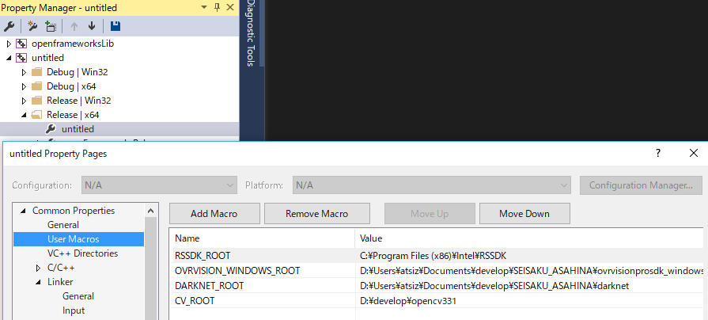

# untitled

## Environment

- Windows10 x64
- Visual Studio Community 2015

### devices

- Oculus Rift CV1
- Ovrvision Pro
- Intel Realsense SR300 (new version)

## Setup

### oF and addons

- openFrameworks v0.9.8
- ofxGui

download and put them into `$(OF_ROOT)\addons`

- [ofxOculusRiftCV1](https://github.com/secondstory/ofxOculusRiftCV1)
- [ofxOvrvision](https://github.com/kuanju/ofxOvrvision)
- [ofxRealsense](https://github.com/tyhenry/ofxRealSense)
- [ofxYolo2](https://github.com/lab101/ofxYolo2)

### Other Libraries

#### Requirement

- Download and unzip [OvrvisionPro SDK for Windows](http://ovrvision.com/setup/) anywhere you want (for example `C:\libraries\ovrvisionprosdk_windows\`)
- Install [Oculus Runtime for Windows](https://www.oculus.com/setup/)
- Install [Intel® RealSense™ Camera SR300 Firmware](https://software.intel.com/en-us/realsense-sdk-windows-eol)
- Install [Realsense SDK 2016 R2 for windows 2016 R2](https://software.intel.com/en-us/realsense-sdk-windows-eol) at default directory (`C:\Program Files (x86)\Intel\RSSDK`)

#### if you want

- Download and build [Yolo v2 for Windows](https://github.com/AlexeyAB/darknet) (if you want to modify yolo)

I did this because, I wanted to use newest version of Yolo v2 and cuda, cuDNN.

## How To Build (Release x64)

**NOTICE: THIS APP IS CURRENTLY ONLY FOR RELEASE X64**

### Modify User Macro

to solve file pathes, please modify User Macro to specify the place you installed libraries above.

`Property Manager > untitled > Release | x64 > untitled`

you must modify below.

* `$(DARKNET_ROOT)`
* `$(OVRVISION_WINDOWS_ROOT)`
* `$(RSSDK_ROOT)`

### IF YOU DIDN'T BUILD YOUR YOLOv2 by yourself

and want to use ofxYolo2 binaries,

- Remove `$(DARKNET_ROOT)\src` from Additional Include Directories
- Add `$(OF_ROOT)\addons\ofxYolo2\include` to Additional Include Directories
- Remove `$(DARKNET_ROOT)\build\darknet\x64` from Additional Library Directories
- Add `$(OF_ROOT)\addons\ofxYolo2\dll` to Additional Library Directories

### Remove obstacle files

Not from Windows directories. Remove on VS solution Explorer.

`Solution Explorer > Solution > Project name (untitled)`

- `addons\ofxOculusRiftCV1\libs\LibOVRKernel\src\Tracing`
- `addons\ofxOculusRiftCV1\libs\LibOVRKernel\src\Util`
- `addons\ofxOvrvision\src\main.cpp`
- `addons\ofxOvrvision\src\ofApp.cpp`
- `addons\ofxOvrvision\src\ofApp.h`
- `addons\ofxYolo2\src\main.cpp`
- `addons\ofxYolo2\src\ofApp.cpp`
- `addons\ofxYolo2\src\ofApp.h`

### Replace edited files in ofxAddons/libraries.

you have to replace some addon files with files in the `modified` floder (to get some modified function work)

- `ofxYolo2.cpp`
- `ofxYolo2.h`
- `OvrPro.cpp`
- `OvrPro.h`

### Build

> please check your build configuration is "Release" and "x64".

`Build > Build Solution (Ctrl+Shift+B)`

## How To Run (x64)

### Put DLLs in bin folder

- `ovrvison.dll` (from `$(OVRVISION_ROOT)\bin\x64`)
- `OpenAl32.dll` (from `$(OVRVISION_ROOT)\bin\x64`)
- `yolo_cpp_dll.dll` (if you don't build yourself, please get it from `ofxYolo2/dll/`)

### Modify YOLO needed files under `bin/data`

- `yolo-obj.cfg`
- `yolo-obj.weights`
- `obj.names`

